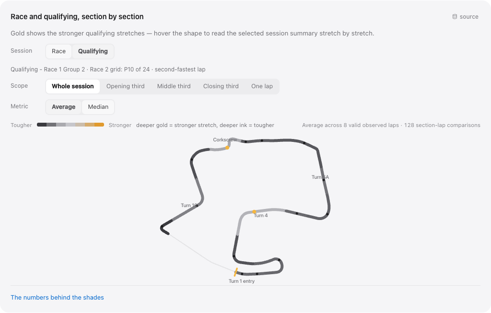

# BryceCast

**A race-weekend companion and career archive for one driver, built from public timing data.**

My friend Bryce Aron races in INDY NXT, the series one step below IndyCar. I wanted a better way to follow his weekends than refreshing a timing screen, so I built one: a site that polls live timing once a second during a session, keeps everything it sees, and turns it into things a timing screen can't show you — where on the track he's gaining or losing time, where a pass actually happened, what the wind was doing in Turn 4, and how this weekend compares with every other race of his career back to 2019.

It runs at **[brycecast.com](https://brycecast.com)** on a Mac mini. This repository is the whole thing: the collectors, the archive, the analysis, the React app, and the automation that rolls new data in after each race.

[Live site](https://brycecast.com) · [Case studies](docs/case-studies/README.md) · [Architecture](docs/engineering/ARCHITECTURE.md) · [Run it yourself](#run-it) · [Data sources](DATA_SOURCES.md)



## By the numbers

| | |
| --- | --- |
| **8 seasons, 7 series** | Bryce's career from F1600 in 2019 through Formula Ford, GB3, Euroformula Open, Formula Regional Oceania, IMSA and INDY NXT — 87 events, 493 sessions, 42 tracks |
| **75,589 laps** | Lap-level records across the career, alongside 8,943 session results covering 556 drivers, so every result has the full field around it |
| **2.6 million timing-loop crossings** | Every car over every timing loop in 143 INDY NXT sessions, decoded from raw timing recordings at 0.0001-second resolution |
| **45 of 45 races** | Every INDY NXT race from 2024 to 2026 has timing and a replay you can scrub through |
| **1-second polling** | The live collector samples Race Control once a second while cars are on track; the archive behind the site holds about 6 GB of those snapshots |
| **135 sessions with weather** | Hourly conditions joined to the exact session window and track location, not just the date |

Every figure is recomputed by `npm run portfolio:stats` into a [receipt](docs/evidence/portfolio-stats.json) with dates, definitions and source hashes. Where a number has an asterisk — coverage gaps, modeled rather than measured weather — the [case studies](docs/case-studies/README.md) say so.

## How it works

```text
collect ──► archive ──► normalize ──► analyze ──► serve
```

- **Collect.** On a race weekend a single supervised runner owns all upstream polling. It idles at a five-minute heartbeat, tightens to 15 seconds as a session approaches, samples once a second while it's live, then cools down. Historical seasons come from official results, timing PDFs and public timing archives, each pulled by its own importer.
- **Archive.** Snapshots go into SQLite. One-second captures repeat most of their payload, so each distinct payload is stored once by content hash and observations point at it. Raw source files are kept byte-for-byte with their hashes.
- **Normalize.** Seven series publish results seven different ways. Importers map them onto one career model — drivers, teams, cars, tracks, sessions, laps — and record which source each fact came from and how much that source can be trusted.
- **Analyze.** Python and Node jobs decode timing loops into laps and sections, place passes between loops, reconcile qualifying formats, join weather, and compare Bryce with teammates and rivals. Each job has a validator, and the build fails if one does.
- **Serve.** The analysis is packed into dated JSON that the React app reads. After a race, an hourly job on the mini notices the new session, reruns the pipeline, checks the result, and builds the updated site.

## The hard parts

These were the problems that took real thought. Each links to a short write-up with the evidence and the limits.

| Problem | What I ended up doing |
| --- | --- |
| **There's no GPS.** I wanted heat maps of where Bryce is fast, and the feed only says when a car crossed a wire in the track. | Decode the loop clocks, reconcile loop distances against each circuit's geometry, and color the track by section. Rebuilt lap times match the official ones to the tick in 21 of 25 races. [Heat maps without GPS](docs/case-studies/01-heatmaps-without-gps.md) |
| **A lap chart says the order changed, not where.** | Rebuild the running order at every loop, so a pass is pinned between two named points on the track — and never claimed more precisely than that. [Pass placement](docs/case-studies/02-pass-placement.md) |
| **The collector died mid-race.** During a Road America drill, overlapping monitors used up the machine's process slots and capture stopped for 26 minutes. | Rebuild around one ingestor that owns polling and writing, with every viewer reading its cache. The gap is still in the record. [Live reliability](docs/case-studies/06-live-reliability.md) |
| **One-second captures were eating the disk.** | Content-addressed storage: each payload once, every observation a reference. Reconstruction is byte-identical, and there's a runnable migration test. [SQLite archive](docs/case-studies/08-sqlite-archive.md) |
| **Every series does qualifying differently.** Groups, combined grids, doubleheaders, two-lap oval averages. | One qualifying model that keeps each format's rules separate and leaves a rank blank when the source doesn't give one. [Qualifying](docs/case-studies/03-qualifying.md) |
| **"It rained that day" isn't weather data.** | Join conditions to the exact session window and track, then rotate the wind bearing into the track map's frame so an arrow over Turn 4 means what it looks like. [Weather and wind](docs/case-studies/04-weather-and-wind.md) |
| **My best-scoring prediction model was cheating.** | It was reading information from after the race. I kept the failed models and the null results, and the site makes no forecasts. [Models and leakage](docs/case-studies/05-models-and-leakage.md) |
| **A 2019 F1600 season and a 2026 INDY NXT season are not the same depth of data.** | Normalize what's comparable, keep track of what each source can support, and build series-specific views for the rest. [Career and competitors](docs/case-studies/07-career-and-competitors.md) |

The [engineering atlas](docs/engineering/ENGINEERING_ATLAS.md) is the long version: cautions and restarts, race narratives, identity matching, archive discovery, and the integrity checks behind it all.

## Run it

You need **Node.js 24**.

```bash
npm ci --ignore-scripts
npm run build
npm run demo
```

Open **http://127.0.0.1:4173**. That's the real app serving a dated snapshot of the analysis that ships in this repo: Races, Tracks and Career all work. Nothing is polled and nothing talks to the live site.

To go past the snapshot and run the pipeline end to end, pull the source data:

```bash
npm run data:restore
```

That downloads the latest data release — the raw career corpus, the timing captures and the replay feeds, about 855 MB — verifies every file against its checksum, and unpacks it into the paths the pipeline expects. From there you can validate and regenerate the analysis from source and play back any of the 45 races; the [development guide](docs/engineering/DEVELOPMENT.md) has the commands. The one thing that isn't published is the live site's own SQLite archive, which is a 6 GB working database.

Two small examples run with no data at all, if you just want to see a method work:

```bash
npm run example:timing   # the real lap decoder on invented crossings, including a pit-lane finish most decoders miss
npm run example:sqlite   # the archive migration on a synthetic 600-snapshot database
```

## What's where

- `src/` — the React and TypeScript app: screens, typed data adapters, track geometry, section rendering.
- [scripts/](scripts/README.md) — collectors, importers, the API server, post-race automation, and validators.
- [analysis/](analysis/README.md) — the analytical jobs, their outputs, and dated audits.
- [data/](data/README.md) — source manifests, coverage and validation reports, schemas.
- `examples/` — small synthetic demonstrations of the trickier methods.
- [docs/](docs/README.md) — architecture, case studies, contracts, and runbooks. The [archive](docs/archive/README.md) keeps the drills, audits and design briefs from along the way.

The scripts that deploy to my own Mac mini live in a separate private repository, since nobody else has a use for them. Everything else is here.

## Data and credits

BryceCast is a non-commercial fan project, and none of it would exist without the people who publish timing data. Live and recorded timing comes from **INDYCAR Race Control**, **[RaceTools](https://racetools.com)** and **[Timing71](https://www.timing71.org)**. Career results come from each series' official results service, weather from **[Open-Meteo](https://open-meteo.com)**, and track geometry from **OpenStreetMap** contributors. [DATA_SOURCES.md](DATA_SOURCES.md) lists every source, what came from it, and how it was collected.

Everything here was gathered from pages and feeds those organizations publish openly, and it all remains theirs. If you represent one of them and would like something removed, open an issue or reach me through my GitHub profile and I'll take it down.

## History and license

The history starts on June 8, 2026 with a working baseline and runs to today; [development history](docs/project/DEVELOPMENT_HISTORY.md) walks through the milestones.

The code is [MIT licensed](LICENSE). That license covers my software, not the third-party data, photos, logos or track maps, which stay with their owners.
