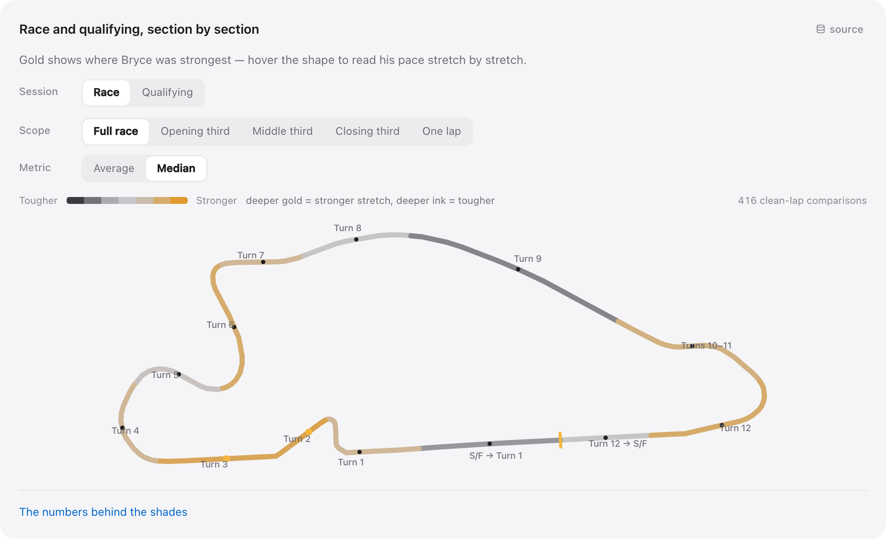

# BryceCast

**Live timing capture, race replay, and career analytics for an INDY NXT driver, reconstructed entirely from public timing feeds.**

BryceCast is a full-stack data system that tracks Bryce Aron, a driver in INDY NXT, the series directly below IndyCar. During a session it samples the public Race Control feed once per second and archives every response. Afterward it decodes the raw timing-loop records into laps, track sections, and on-track passes, joins them to weather and to eight seasons of career results, and publishes the analysis through a React application at **[brycecast.com](https://brycecast.com)**.

The defining constraint is that public timing carries no GPS and no telemetry. The only positional signal is the instant each car crosses a timing loop embedded in the circuit. Every spatial view in the application — section pace maps, pass locations, race replay — is reconstructed from those crossings and validated against the official results.

This repository contains the complete system: the collectors, a content-addressed SQLite archive, importers for seven racing series, the analysis jobs and their validators, the React and TypeScript front end, and the automation that ingests each new race without intervention.

[Live site](https://brycecast.com) · [Case studies](docs/case-studies/README.md) · [Architecture](docs/engineering/ARCHITECTURE.md) · [Run it locally](#run-it-locally) · [Data sources](DATA_SOURCES.md)



*2024 Grand Prix of Portland, where Bryce started sixth and finished third. Each timing section is shaded by his median pace relative to the field across 32 green-flag laps (416 section times). Gold marks the sections where he ranked near the front of the field, Turns 2–3 and Turn 12; ink marks where he gave up time, the run through Turn 9 and the front straight. The map is derived from timing loops, not vehicle coordinates.*

## Capabilities

- **Live session tracking.** Running order, gaps, and flag state refresh once per second during a session, with near-track weather and wind direction rotated into the orientation of the track map.
- **Race replay.** All 45 INDY NXT races from 2024 through 2026 can be replayed from archived timing through the same data contract the live views use.
- **Section pace maps.** Race and qualifying pace for each timing section, ranked against the full field and filterable by race phase, single lap, and average or median.
- **Pass placement.** Each change in running order is bracketed between two named timing loops instead of being reported only as a lap-chart delta.
- **Career archive.** Every session of Bryce's career since 2019 across seven series, with teammate, rival, and full-field context for each result.

## Scale

| | |
| --- | --- |
| **8 seasons, 7 series** | F1600, Formula Ford, GB3, Euroformula Open, Formula Regional Oceania, IMSA, and INDY NXT, 2019–2026: 87 events, 493 sessions, 42 tracks |
| **75,589 laps** | Lap-level records, plus 8,943 session results covering 556 drivers, so each result is stored with the field around it |
| **2.6 million loop crossings** | Every car over every timing loop in 143 INDY NXT sessions, decoded from raw timing captures at 0.0001-second resolution |
| **45 of 45 races** | Complete timing and replay coverage of INDY NXT races, 2024–2026 |
| **1 Hz capture** | One Race Control sample per second while cars are on track; the production archive holds roughly 6 GB of snapshots |
| **135 sessions with weather** | Hourly conditions joined to each session's exact time window and track location, not to the calendar date |

`npm run portfolio:stats` recomputes every figure into a [receipt](docs/evidence/portfolio-stats.json) that records dates, definitions, and source hashes. Coverage gaps, and values that are modeled and not measured, are documented in the [case studies](docs/case-studies/README.md).

## Architecture

```text
collect ──► archive ──► normalize ──► analyze ──► serve
```

- **Collect.** A single supervised runner owns all upstream polling. It idles on a five-minute heartbeat, tightens to 15 seconds as a session approaches, samples at one second while the session is live, then cools down. Historical seasons are imported from official results services, timing PDFs, and public timing archives, each through a dedicated importer.
- **Archive.** Snapshots are written to SQLite. Consecutive one-second captures repeat most of their payload, so each distinct payload is stored once under its SHA-256 hash and every observation references it. Raw source files are retained byte-for-byte alongside their hashes.
- **Normalize.** Seven series publish results in seven formats. Importers map them onto one career model of drivers, teams, cars, tracks, sessions, and laps, and record the source and trust tier behind every fact.
- **Analyze.** Python and Node jobs decode timing loops into laps and sections, place passes between loops, reconcile qualifying formats, join weather, and compare Bryce with teammates and rivals. Each job ships with a validator, and a failing validator fails the build.
- **Serve.** Results are packaged as dated JSON consumed by the React application. After each race, an hourly job detects the new session, reruns the pipeline, verifies the output, and rebuilds the site.

**Stack:** TypeScript, React 19, Vite, and Recharts on the front end; Node.js 24 for the collectors, API server, and automation; Python for analysis; SQLite for storage; GitHub Actions for CI. Production runs on a Mac mini.

## Engineering highlights

Each item links to a case study covering the method, the validation evidence, and the limits of the result.

**Section pace maps without GPS.** The feed reports when a car crossed a loop, not where the car is. The decoder converts raw loop clocks into laps, reconciles loop distances against each circuit's geometry, and maps official timing sections onto a curated track outline. Reconstructed lap times match the official lap times to the 0.0001-second tick, at the median, in 21 of 25 validated races. [Case study](docs/case-studies/01-heatmaps-without-gps.md)

**Pass placement between timing loops.** A lap chart shows that the running order changed during a lap, not where on the circuit it changed. BryceCast rebuilds the running order at every loop, which bounds each pass between two named points and claims no precision beyond that. Across 28 validated races, mean pairwise concordance with the official lap-chart order is 99.65%. [Case study](docs/case-studies/02-pass-placement.md)

**Content-addressed archive.** One-second capture was growing the database by roughly 1.3 GB per hour, and an audit of the legacy archive found that 94% of its stored bytes were duplicates. The redesigned archive stores each payload once by content hash and records every observation as a timestamped reference, so capture cadence is preserved without the duplication. The migration runs as a repeatable test against a synthetic database, in which all 600 snapshots rehydrate byte-identically. [Case study](docs/case-studies/08-sqlite-archive.md)

**Live reliability after a capture failure.** During a Road America drill, overlapping collectors and monitors exhausted the host's process table and capture stopped for 26 minutes. The live path was rebuilt around a single ingestor that owns polling and persistence, with every viewer reading from its cache, governed by explicit lifecycle phases, lock aging, and a process budget. The gap remains in the record. [Case study](docs/case-studies/06-live-reliability.md)

**One qualifying model across incompatible formats.** Group sessions, combined grids, doubleheaders, reverse grids, and two-lap oval averages all set a starting order differently. A single model keeps each format's rules explicit, links a qualifying result to a race only when the official grid confirms it, and leaves a rank empty when the source does not supply one. [Case study](docs/case-studies/03-qualifying.md)

**Weather with temporal and spatial precision.** Conditions are joined only to sessions with a source-backed time window; 78 sessions known only by date were skipped, not estimated. Wind bearings are converted from meteorological "from" direction to direction of travel and rotated into each track map's orientation, so an arrow drawn over a corner points where the wind was actually blowing. [Case study](docs/case-studies/04-weather-and-wind.md)

**Leakage detection in predictive models.** The lowest-error finishing-position model in the backtest was using information available only after the race. It was rejected as a leakage control; the failed candidates and null results are retained, and the site publishes no forecasts. [Case study](docs/case-studies/05-models-and-leakage.md)

**Career data of unequal depth.** A 2019 F1600 season and a 2026 INDY NXT season do not support the same analysis. The career model normalizes what is comparable, records what each source can support, and leaves the remainder to series-specific views instead of imputing missing data. [Case study](docs/case-studies/07-career-and-competitors.md)

The [engineering atlas](docs/engineering/ENGINEERING_ATLAS.md) covers the rest: caution and restart analysis, race narratives, identity matching, archive discovery, and the integrity checks behind each.

## Data integrity

The pipeline is designed so that no view claims more than its source supports. Every fact carries its source and a trust tier. Measured values are kept distinct from derived ones in the data model and in the interface. Missing data renders as missing; it is never interpolated. Metrics report their denominators, and sections with too few clean laps stay uncolored. Known capture gaps, excluded sessions, and rejected models are part of the published record. CI builds the application and runs the publication test suite on every change.

## Run it locally

Requires **Node.js 24**.

```bash
npm ci --ignore-scripts
npm run build
npm run demo
```

Open **http://127.0.0.1:4173**. This is the production application serving the dated analysis snapshot included in this repository; Races, Tracks, and Career are fully functional. It performs no polling and makes no requests to the live site.

To run the pipeline end to end, restore the source data:

```bash
npm run data:restore
```

This downloads the latest data release (the raw career corpus, timing captures, and replay feeds, about 855 MB), verifies every file against its checksum, and unpacks it into the paths the pipeline expects. From there the analysis can be validated and regenerated from source, and any of the 45 races can be replayed; the [development guide](docs/engineering/DEVELOPMENT.md) lists the commands. The live site's 6 GB working SQLite archive is the only component not published.

Two self-contained examples run without any data:

```bash
npm run example:timing   # the production lap decoder on synthetic crossings, including a pit-lane finish
npm run example:sqlite   # the archive migration on a synthetic 600-snapshot database
```

## Repository layout

- `src/` — React and TypeScript application: screens, typed data adapters, track geometry, section rendering.
- [scripts/](scripts/README.md) — collectors, importers, the API server, post-race automation, and validators.
- [analysis/](analysis/README.md) — analysis jobs, their outputs, and dated audits.
- [data/](data/README.md) — source manifests, coverage and validation reports, schemas.
- `examples/` — synthetic demonstrations of the timing decoder and the archive migration.
- [docs/](docs/README.md) — architecture, case studies, contracts, and runbooks. The [archive](docs/archive/README.md) retains the drills, audits, and design briefs produced during development.

Deployment scripts specific to the production host are kept in a separate private repository. Everything else is here.

## Data sources and credits

BryceCast is a non-commercial project that depends entirely on organizations that publish timing data. Live and recorded timing comes from **INDYCAR Race Control**, **[RaceTools](https://racetools.com)**, and **[Timing71](https://www.timing71.org)**. Career results come from each series' official results service, weather from **[Open-Meteo](https://open-meteo.com)**, and track geometry from **OpenStreetMap** contributors. [DATA_SOURCES.md](DATA_SOURCES.md) lists every source, what was taken from it, and how it was collected.

All data was gathered from openly published pages and feeds and remains the property of its publishers. If you represent one of them and want material removed, open an issue or contact me through my GitHub profile and it will be taken down.

## History and license

Development history begins on June 8, 2026; the [development history](docs/project/DEVELOPMENT_HISTORY.md) walks through the milestones.

The code is [MIT licensed](LICENSE). The license covers the software only, not third-party data, photographs, logos, or track maps, which remain with their owners.
