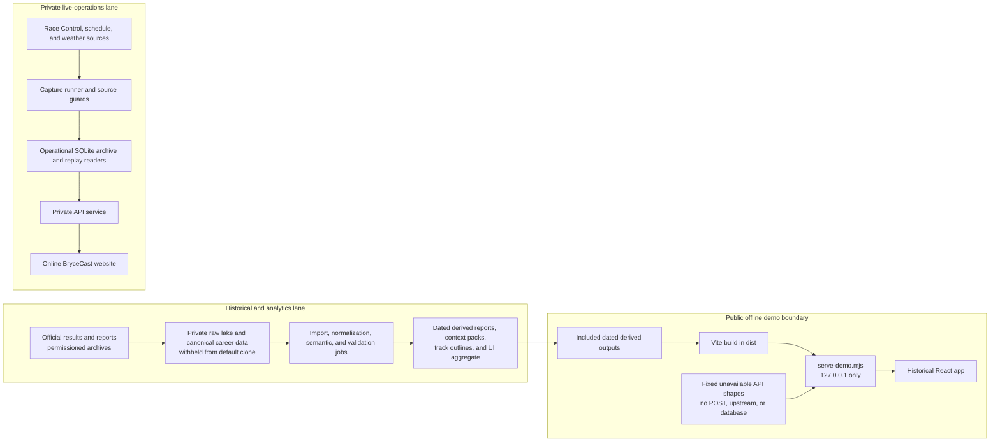

# BryceCast architecture

BryceCast has three distinct execution boundaries: a historical analytics lane, a private live-operations lane, and a read-only offline portfolio demo. The existing BryceCast website is online. This document describes repository design; it does not assert that any production process, feed, database, or deployment is running now.



## Historical lane

The full pipeline preserves raw source objects, normalizes them into stable entities, derives analytical tables, validates joins and metric contracts, and finally emits compact UI artifacts. The public candidate begins at the derived-output boundary. Its central artifact is the dated [UI data package](../analysis/ui-data-package/ui-data-package.json), supported by [context packs](../analysis), the [timing-coverage ledger](../data/historical-data-lake/catalog/timing-coverage-ledger.json), [generated career reports](../data/career/reports), public history JSON, and compact track outlines.

The default build does not require the canonical career dataset, raw career archive, timing lake, or operational SQLite database. Their paths and hashes may appear in provenance records without embedding their contents. A hash proves which withheld snapshot produced an output; it does not make that output independently reproducible from the public clone.

The declared build is:

```text
npm run build
  = tsc
  && vite build
  && node scripts/write-release.mjs
```

The unchanged frontend build depends on:

- the TypeScript/React/CSS source under `src/`;
- 14 compact track-outline JSON files under `src/assets/tracks/`;
- `analysis/ui-data-package/ui-data-package.json`;
- JSON context packs under `analysis/**/output/context-packs/`;
- `data/historical-data-lake/catalog/timing-coverage-ledger.json`;
- `analysis/career-atlas/output/world_land_texture.png`;
- `public/`, the build configuration, and `scripts/write-release.mjs`.

Cached OSM responses and track-map source images are generator inputs rather than application imports. They are outside the first release unless their rights are cleared separately.

## Live-operations lane

The private live design has a capture runner, source-readiness guards, an operational archive, replay readers, weather adapters, and an API service. Its responsibilities include preserving source timestamps, distinguishing cold/stale/live state, refusing unsafe refreshes, and reconciling provisional timing with official results.

This lane is intentionally absent from the offline demo path. Starting the production API is not an acceptable way to preview the public snapshot: its normal responsibilities include upstream source access and optional archive/database reads. Operational deployment details, credentials, hostnames, LaunchAgents, and runtime archives are separate from the source release.

## Offline demo boundary

[`scripts/serve-demo.mjs`](../scripts/serve-demo.mjs) serves only `dist` and local derived JSON. It binds to `127.0.0.1`, injects a visible historical/data-as-of banner, supplies a sanitized `pre_session` response, returns unavailable weather and schedule shapes, withholds timing downloads as `permission_pending`, and rejects mutating methods. It imports no production API, poller, replay, weather, or SQLite module.

```bash
npm ci
npm run build
npm run demo
# optional alternate port
npm run demo -- --port 4300
```

The matching real-HTTP check is [`scripts/test-publication-demo.mjs`](../scripts/test-publication-demo.mjs):

```bash
npm run test:publication:demo
```

Historical race, career, track, and aggregate views are real dated outputs. The Live screen is an unavailable explanatory state. It is not a simulated current race and does not claim fresh weather, a next session, or an active replay.

## What a default clone proves

A default clone can build the React application from included derived outputs, run the offline demo, verify included artifact hashes and adapters, exercise the timing decoder with invented rows, and create temporary synthetic SQLite fixtures for archive-format tests. See [DATA_RELEASE.md](../DATA_RELEASE.md) for exact commands and limits.

It cannot recreate the complete historical warehouse, reacquire source material, reproduce every headline from raw evidence, inspect the operational archive, or prove current live behavior. Those require permissioned source corpora or a separately authorized runtime.

Related documents: [data dictionary](DATA_DICTIONARY.md), [data-release policy](../DATA_RELEASE.md), and [permissions outreach](PERMISSIONS_OUTREACH.md).
